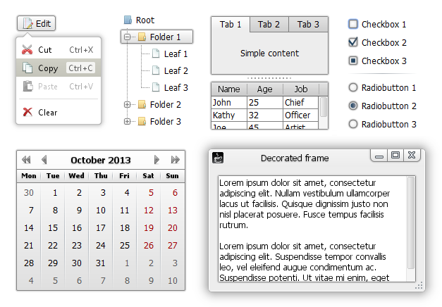
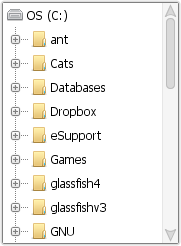

Important information
==========
This is a temporary fork for styling improvements publishing.
It is not compileable yet and still in work, but will soon be useable.

As soon as all changes are done it will be merged into the main repository.
It contains major changes to all components styling methods.

Basically - almost all bridge methods will be removed from Web-components.
All those settings will now be provided through XML styling files.
I will publish an extensive guide on how it can be used as soon as it is released.


WebLaF
==========
**WebLaf** is a Java Swing Look and Feel and extended components library for cross-platform applications.<br>
<br>
You can find some more screenshots at the end of this page!


Advantages
----------

- Simple and stylish cross-platform default theme
- Lots of useful custom Swing components
- Fully stylable through settings, painters and custom skins
- Language, settings, hotkey, tooltip and other custom managers
- Various Swing and general utilities for many possible cases
- Full support for RTL components orientation

You can find more information about the library on official site:<br>
http://weblookandfeel.com


Delayed v1.29 update
---------
Due to the large amount of features, fixes and improvements coming with this update - I have already delayed it a few times but it still requires a lot of work to do. So I have made some changes that might clarify what is happening with WebLaF right now.

First of all - I have published pre-release artifacts on the site and updating them with each major feature or fix made. You can find all standard artifacts (except JavaDoc HTML version) here:<br>
http://weblookandfeel.com/downloads/prerelease/<br>
These pre-release artifacts should usually be more stable than previous versions, but might contain some minor bugs which will be quickly patched up. It is up to you to decide whether you want to use those or not.

One more important change was made to milestones in issue tracker here on GitHub:<br>
https://github.com/mgarin/weblaf/milestones<br>
I have removed old uncertain milestones (which weren't milestones actually) and have added understandable versions there. I have already sorted out all features and fixes planned for v1.29 and I will sort others after this release. I have also added approximate release dates into those milestones - they aren't set in stone, but I hope these won't be too different from actual release dates since now I can clearly see what is left for that version and how long it should take to release.

Issues solved for v1.29 version aren't yet closed, but with next versions I will be closing those right away as soon as the fix is available in GIT repository so you will be able to track milestone progress.

I am also trying to prioritize user requests over planned features in case that is possible at the moment request is made. Usually I would add small features right away and postpone large ones till the next update in case those doesn't fit into current update. So don't hesitate to [post requests](https://github.com/mgarin/weblaf/issues), even small ones.

More changes are coming and I will make additional notes here later as soon as those are made.


Important v1.28 changes
---------
There were a lot of internal changes in v1.28 update - library separation, build improvements, new features and major code cleanup.
You might need to re-check which of the new artifacts you want to use since `weblaf-x.xx.jar` doesn't contain dependencies anymore - `weblaf-complete-x.xx.jar` contains them instead.

I also wanted to make this project more transparent and clear, so I have made a few additional improvements in v1.28 update...

Two new artifacts available - `weblaf-core-x.xx.jar` and `weblaf-ui-x.xx.jar`:
- The first one contains some core WebLaF managers and utilities you might want to use separately from WebLaF UI
- WebLaF UI contains all L&F classes, extended components and all features tied to them
Standalone core jar might be useful in case you have some server-side application and you want to use some features like `LanguageManager` or `ReflectUtils` but don't want to drag a full UI library into your server (which is a bad thing to do).

I have modified the structure of `weblaf-javadoc-x.xx.jar`, which now reflects the sources structure and properly read by modern IDEs.

I have added `weblaf-src-x.xx.jar` which also has the same structure as `weblaf-x.xx.jar` but contains only source code of WebLaF classes.

Also WebLaF dependencies links are now available below and you can find their short description which tells why and where it is used within WebLaF.
According to that information you might want to exclude some of those dependencies in case they aren't useful to you.
I might add some more information later on if someone actually needs it.


Moving forward
---------
I also wanted to make another important announcement - starting with v2.00 all WebLaF code will be refactored to make use of JDK 8 (or even JDK 9) features.

At that point I won't be able to implement all new features into both v1.xx and v2.xx versions anymore due to time constraints I have.
So all new features will be implemented only into the v2.xx versions, but v1.xx versions will still be supported for those who cannot upgrade for the certain reasons.
So basically v1.xx will be updated with critical bugfixes and probably some minor improvements i might be able to merge from v2.xx.

There are a few reasons why I decided to move forward from currently supported JDK 1.6.0_30+:
- There are some bugs in older JDKs for which I have to make some dirty workarounds - I want to get rid of those
- Older JDKs doesn't have a proper support for newer OS versions which is critical for some features and components
- I really want to make WebLaF code clean and readable and I want improve some parts of it with the new features JDK offers
- I might be looking into JavaFX later on as a second option to the WebLaF UI part

A lot of other projects I am working on are already using JDK8 and I can see the big difference.
It is still a long way to go from current WebLaF state, but I wanted to make that announcement beforehand so everyone can consider it.

And don't worry, all the features announced for the v1.xx like complete StyleManager and WebDockablePane will be completed and available in later v1.xx versions.


Artifacts
----------
You can always find all WebLaF artifacts in the "releases" section:<br>
https://github.com/mgarin/weblaf/releases

Here are the direct links for the latest release artifacts:

**Complete WebLaF binary with dependencies**

- [**weblaf-complete-1.28.jar**](https://github.com/mgarin/weblaf/releases/download/v1.28/weblaf-complete-1.28.jar) - library complete jar, contains WebLaF classes and all dependencies

**WebLaF binary without dependencies**

- [**weblaf-1.28.jar**](https://github.com/mgarin/weblaf/releases/download/v1.28/weblaf-1.28.jar) - library jar, contains only WebLaF classes

**Separate WebLaF core and UI binaries without dependencies**

- [**weblaf-core-1.28.jar**](https://github.com/mgarin/weblaf/releases/download/v1.28/weblaf-core-1.28.jar) - library core part jar, contains only WebLaF core classes
- [**weblaf-ui-1.28.jar**](https://github.com/mgarin/weblaf/releases/download/v1.28/weblaf-ui-1.28.jar) - library UI part jar, contains only WebLaF UI classes

**Core dependencies**

- [**slf4j-api-1.7.7.jar**](https://github.com/mgarin/weblaf/raw/master/lib/slf4j-api-1.7.7.jar) - Logger used by all WebLaF classes
- [**slf4j-simple-1.7.7.jar**](https://github.com/mgarin/weblaf/raw/master/lib/slf4j-simple-1.7.7.jar) - Logger implementation, you might want to replace it with other SLF4J implementation
- [**xstream-1.4.7.jar**](https://github.com/mgarin/weblaf/raw/master/lib/xstream-1.4.7.jar) - Used by various WebLaF managers and utilities
- [**jericho-html-3.3.jar**](https://github.com/mgarin/weblaf/raw/master/lib/jericho-html-3.3.jar) - Used by HtmlUtils and some other classes
- [**java-image-scaling-0.8.5.jar**](https://github.com/mgarin/weblaf/raw/master/lib/java-image-scaling-0.8.5.jar) - Used for smooth image scaling

**UI dependencies**

- [**rsyntaxtextarea.jar**](https://github.com/mgarin/weblaf/raw/master/lib/rsyntaxtextarea.jar) - It is not required, unless you are using StyleEditor or RSyntaxTextArea itself

**Other artifacts**

- [**weblaf-demo-1.28.jar**](https://github.com/mgarin/weblaf/releases/download/v1.28/weblaf-demo-1.28.jar) - executable WebLaF demo jar
- [**weblaf-src-1.28.zip**](https://github.com/mgarin/weblaf/releases/download/v1.28/weblaf-src-1.28.zip) - project sources zip
- [**weblaf-src-1.28.jar**](https://github.com/mgarin/weblaf/releases/download/v1.28/weblaf-src-1.28.jar) - project sources jar
- [**weblaf-javadoc-1.28.jar**](https://github.com/mgarin/weblaf/releases/download/v1.28/weblaf-javadoc-1.28.jar) - JavaDoc jar
- [**ninepatch-editor-1.28.jar**](https://github.com/mgarin/weblaf/releases/download/v1.28/ninepatch-editor-1.28.jar) - executable Nine-Patch Editor jar


Building
----------
To build various WebLaF artifacts you will need [Java 1.6 update 30 or any later](http://www.oracle.com/technetwork/java/javase/downloads/index.html) including Java 7 and 8 and [Apache ANT] (http://ant.apache.org/).<br>
Simply run `ant` command within the "build" library folder to build all artifacts at once.

Here is a full list of usable ANT targets in WebLaF build script:

**Separate artifact targets**

- `build.core.jar` - build `weblaf-core-x.xx.jar`
- `build.ui.jar` - build `weblaf-ui-x.xx.jar`
- `build.weblaf.jar` - build `weblaf-x.xx.jar`
- `build.weblaf.complete.jar` - build `weblaf-complete-x.xx.jar`
- `build.weblaf.demo.jar` - build `weblaf-demo-x.xx.jar`
- `build.npe.jar` - build `ninepatch-editor-x.xx.jar`
- `build.sources.zip` - build `weblaf-src-x.xx.zip`
- `build.sources.jar` - build `weblaf-src-x.xx.jar`
- `build.javadoc.jar` - build `weblaf-javadoc-x.xx.jar`

**Complex targets**

- `build.all.artifacts` default target, **build all artifacts** at once
- `build.all.artifacts` - build all WebLaF binaries
- `build.common.artifacts` - build common WebLaF binaries
- `build.release.artifacts` - build release WebLaF binaries
- `build.base.artifacts` - build separate WebLaF binaries
- `build.complete.artifacts` - build single WebLaF binaries
- `build.featured.artifacts` - build featured WebLaF binaries
- `build.misc.artifacts` - build miscellaneous WebLaF binaries


Example Usage
----------
To install WebLaF you can simply call `WebLookAndFeel.install()` or use one of standard Swing L&F set methods:
```java
public class UsageExample
{
    public static void main ( String[] args )
    {
        // You should work with UI (including installing L&F) inside Event Dispatch Thread (EDT)
        SwingUtilities.invokeLater ( new Runnable ()
        {
            public void run ()
            {
                // Install WebLaF as application L&F
                WebLookAndFeel.install ();

                // You can also do that with one of old-fashioned ways:
                // UIManager.setLookAndFeel ( new WebLookAndFeel () );
                // UIManager.setLookAndFeel ( "com.alee.laf.WebLookAndFeel" );
                // UIManager.setLookAndFeel ( WebLookAndFeel.class.getCanonicalName () );

                // Create you application here using Swing components
                // JFrame frame = ...

                // Or use similar Web* components to get access to some extended features
                // WebFrame frame = ...
            }
        } );
    }
}
```


Roadmap
----------
You can always check what fixes, features and improvements are coming by checking the milestones page:<br>
https://github.com/mgarin/weblaf/issues/milestones
I am not updating them very frequently, but they actually represent features I want to focus on.


Updates
---------
New WebLaF versions appear approximately every month.

Sometimes it might take less time if there are some small but critical issue fixes, sometimes it might take more time if I am going to release some large feature (like it was with `StyleManager`) as I have to modify/add a lot of code and consider a lot of stuff.

In any case WebLaF is not going to disappear anytime soon. Hopefully Swing won't disappear or become deprecated soon as well.


Feedback
----------
I would really appreciate if you will post any found bugs in [issues section](https://github.com/mgarin/weblaf/issues) here, on GitHub.<br>
You can also post them on the library [official site forum](http://weblookandfeel.com/forum/), but that would require registration.<br> 
And, as always, you can send any feedback directly to my email: [mgarin@alee.com](mailto:mgarin@alee.com)


Some other screenshots
---------
Here are **some** other screenshots of the custom WebLaF components:

`WebTristateCheckBox`<br>


`WebLinkLabel`<br>


`WebCollapsiblePane`<br>


`WebAccordion`<br>


`WebDateField` and `WebCalendar`<br>


`WebMemoryBar`<br>


`WebBreadcrumb`<br>
<br>


`WebFileTree`<br>


`WebColorChooserField`<br>


`WebGradientColorChooser`<br>


`WebStepProgress`<br>


You can find a lot more live examples in the demo application!
