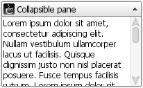
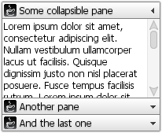
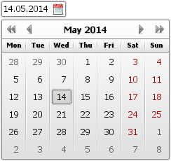

Important information!
==========
This is a temporary branch for styling improvements publishing.

As soon as all changes in this branch are done and properly tested - it will be merged into the main repository. It contains major changes to the way in which all components are styled. It also removes all deprecated APIs from Web- components and UIs.

All styling settings will now be provided through XML styling files. I will publish an extensive guide on how it can be used as soon as it is released. Don't worry, all previously existing features will still be available in one or another form.


WebLaF
==========
**WebLaf** is a Java Swing Look and Feel and extended components library for cross-platform applications.<br>
<br>
You can find some more screenshots at the end of this page!


Branch [`styling`](https://github.com/mgarin/weblaf/tree/styling)
----------
I have added a temporary project branch [`styling`](https://github.com/mgarin/weblaf/tree/styling) where almost all new changes are added right now. This branch contains changes required to enable styling support for all existing components. It isn't stable right now and might even be uncompilable sometimes, but as soon as I finish adding modifications it will be merged into the `master` branch and I will finally be able to release v1.29 update.

I was going to postpone a lot of those changes and release only small chunks one by one but that would force me to add even more workarounds for older parts of the code. So I have decided to finish it in one sweep. Originally this was the goal of v1.40 release, but it is coming sooner than expected. Some improvements will still be made on the way to v1.40 release, but the main part will be added in next update and it won't be a simple preview - it will be fully working styling system.

So let me go into some specifics of changed you will see:

- **Web- components and UIs do not provide bridge methods anymore**<br>To put it simple - all style-related methods like `panel.setRound(...)` or `button.setShadeWidth(...)` are now gone. Of course those settings aren't gone - they are now provided through the XML-based skins into component painters. That might add some minor constraints, but in the end it simplifies applications code by separating styling from the UI composition and actual application logic code. Also a lot of new features are built on top of that simplification which will fill-in the gaps, so don't worry - you will have all of the options you had before in some form. Also these methods took more than a half of development time last few months just to be added and supported. No more. It was a bad design decision to add them in the first place, I admit it now.

- **Advanced styling is now supported by all WebLaF components**<br>This basically allows styling any component and any of its parts using the customizable skins. You will even be able to use multiply skins in single application at the same time! Each skin is a combination of its XML description file(s) and painter classes for specified components. When skin is applied to some specific component it forces it to use painters and settings provided in XML.

- **Much more settings for each component**<br>Until now each component painting code was attached to the component-specific UI. That forced me to provide all style-related settings into each UI even though a lot of them might be the same between different components (like the decoration `round` or `shadeWidth`). Upcoming changes will remove these constraints - all components painting will now be performed in their painters which are almost fully separated from UIs and have much more freedom. As an example, a lot of component painters will now extend `WebDecorationPainter` which paints base WebLaF components decoration and contains all visual settings like `round`, `shadeWidth` or `borderColor`. So if I would want to add some new visual feature or fix some glitch - it will be enough to modify just that class.

- **Unified `margin` and `padding`**<br>In previous versions of WebLaF I have widely used margin and have provided it as an option in almost all of the basic components. It was some kind of a replacement for spacing between content and border... at least usually. Not too convenient, right? Now you will have two options in almost each component - `margin` and `padding` (in some components `padding` is not applicable so it is simply not supported there). They will act similarly to CSS margin and padding - `margin` will always provide spacing between component styling and its bounds, `padding` will always provide spacing between component styling and component content (basically what old margin was used for in most cases). You will be able to provide these settings directly into Web- component, its UI or in skin XML file.

- **Grouping UI elements**<br>In earlier versions of WebLaF I have introduced `WebButtonGroup` which allowed you to group buttons visually with ease. Though it couldn't group other elements like panels, comboboxes or textfields and that was a strict limitation I was not able to overcome. Until now. Next update will feature new options to group any UI elements with partial decoration support - panels, buttons, textfields, spinners etc. - there will be many of them! You will be able to group those visually (both vertically and horizontally) by simply adding them in a single grid-like container which will handle the rest. You will also be able to control that container side-decoration so that group of elements can be easily integrated into any possible UI part.

- **New `StyleEditor` tool**<br>Last but not least - there will be a new tool available for creating new skins and editing them right in your live application! This tool was in the sources for a long time, but it was not finished due to required changes. It will now get some love and it should be really handy in creating new skins or tweaking existing ones. You will be able to edit skin XML and instantly see the results on the UI elements in preview and in any WebLaF-based application launched on the same JRE.

This update is one of the biggest made to WebLaF since its initial release so I will be adding much more information on each specific feature separately on [wiki](https://github.com/mgarin/weblaf/wiki/How-to-use-StyleManager) and on the official WebLaF site as soon as it is released, so stay tuned!


Advantages
----------

- Simple and stylish cross-platform default theme
- Lots of useful custom Swing components
- Fully stylable through settings, painters and custom skins
- Language, settings, hotkey, tooltip and other custom managers
- Various Swing and general utilities for many possible cases
- Full support for RTL components orientation

You can find more information about the library on official site:<br>
http://weblookandfeel.com


Artifacts
----------
You can always find all WebLaF artifacts in the "releases" section:<br>
https://github.com/mgarin/weblaf/releases

Here are the direct links for the latest release artifacts:

**Complete WebLaF binary with dependencies**

- [**weblaf-complete-1.28.jar**](https://github.com/mgarin/weblaf/releases/download/v1.28/weblaf-complete-1.28.jar) - library complete jar, contains WebLaF classes and all dependencies

**WebLaF binary without dependencies**

- [**weblaf-1.28.jar**](https://github.com/mgarin/weblaf/releases/download/v1.28/weblaf-1.28.jar) - library jar, contains only WebLaF classes

**Separate WebLaF core and UI binaries without dependencies**

- [**weblaf-core-1.28.jar**](https://github.com/mgarin/weblaf/releases/download/v1.28/weblaf-core-1.28.jar) - library core part jar, contains only WebLaF core classes
- [**weblaf-ui-1.28.jar**](https://github.com/mgarin/weblaf/releases/download/v1.28/weblaf-ui-1.28.jar) - library UI part jar, contains only WebLaF UI classes

**Core dependencies**

- [**slf4j-api-1.7.7.jar**](https://github.com/mgarin/weblaf/raw/master/lib/slf4j-api-1.7.7.jar) - Logger used by all WebLaF classes
- [**slf4j-simple-1.7.7.jar**](https://github.com/mgarin/weblaf/raw/master/lib/slf4j-simple-1.7.7.jar) - Logger implementation, you might want to replace it with other SLF4J implementation
- [**xstream-1.4.7.jar**](https://github.com/mgarin/weblaf/raw/master/lib/xstream-1.4.7.jar) - Used by various WebLaF managers and utilities
- [**jericho-html-3.3.jar**](https://github.com/mgarin/weblaf/raw/master/lib/jericho-html-3.3.jar) - Used by HtmlUtils and some other classes
- [**java-image-scaling-0.8.5.jar**](https://github.com/mgarin/weblaf/raw/master/lib/java-image-scaling-0.8.5.jar) - Used for smooth image scaling

**UI dependencies**

- [**rsyntaxtextarea.jar**](https://github.com/mgarin/weblaf/raw/master/lib/rsyntaxtextarea.jar) - It is not required, unless you are using StyleEditor or RSyntaxTextArea itself

**Other artifacts**

- [**weblaf-demo-1.28.jar**](https://github.com/mgarin/weblaf/releases/download/v1.28/weblaf-demo-1.28.jar) - executable WebLaF demo jar
- [**weblaf-src-1.28.zip**](https://github.com/mgarin/weblaf/releases/download/v1.28/weblaf-src-1.28.zip) - project sources zip
- [**weblaf-src-1.28.jar**](https://github.com/mgarin/weblaf/releases/download/v1.28/weblaf-src-1.28.jar) - project sources jar
- [**weblaf-javadoc-1.28.jar**](https://github.com/mgarin/weblaf/releases/download/v1.28/weblaf-javadoc-1.28.jar) - JavaDoc jar
- [**ninepatch-editor-1.28.jar**](https://github.com/mgarin/weblaf/releases/download/v1.28/ninepatch-editor-1.28.jar) - executable Nine-Patch Editor jar


Building
----------
To build various WebLaF artifacts you will need [Java 1.6 update 30 or any later](http://www.oracle.com/technetwork/java/javase/downloads/index.html) including Java 7 and 8 and [Apache ANT] (http://ant.apache.org/).<br>
Simply run `ant` command within the "build" library folder to build all artifacts at once.

Here is a full list of usable ANT targets in WebLaF build script:

**Separate artifact targets**

- `build.core.jar` - build `weblaf-core-x.xx.jar`
- `build.ui.jar` - build `weblaf-ui-x.xx.jar`
- `build.weblaf.jar` - build `weblaf-x.xx.jar`
- `build.weblaf.complete.jar` - build `weblaf-complete-x.xx.jar`
- `build.weblaf.demo.jar` - build `weblaf-demo-x.xx.jar`
- `build.npe.jar` - build `ninepatch-editor-x.xx.jar`
- `build.sources.zip` - build `weblaf-src-x.xx.zip`
- `build.sources.jar` - build `weblaf-src-x.xx.jar`
- `build.javadoc.jar` - build `weblaf-javadoc-x.xx.jar`

**Complex targets**

- `build.all.artifacts` default target, **build all artifacts** at once
- `build.all.artifacts` - build all WebLaF binaries
- `build.common.artifacts` - build common WebLaF binaries
- `build.release.artifacts` - build release WebLaF binaries
- `build.base.artifacts` - build separate WebLaF binaries
- `build.complete.artifacts` - build single WebLaF binaries
- `build.featured.artifacts` - build featured WebLaF binaries
- `build.misc.artifacts` - build miscellaneous WebLaF binaries


Example Usage
----------
To install WebLaF you can simply call `WebLookAndFeel.install()` or use one of standard Swing L&F set methods:
```java
public class UsageExample
{
    public static void main ( String[] args )
    {
        // You should work with UI (including installing L&F) inside Event Dispatch Thread (EDT)
        SwingUtilities.invokeLater ( new Runnable ()
        {
            public void run ()
            {
                // Install WebLaF as application L&F
                WebLookAndFeel.install ();

                // You can also do that with one of old-fashioned ways:
                // UIManager.setLookAndFeel ( new WebLookAndFeel () );
                // UIManager.setLookAndFeel ( "com.alee.laf.WebLookAndFeel" );
                // UIManager.setLookAndFeel ( WebLookAndFeel.class.getCanonicalName () );

                // Create you application here using Swing components
                // JFrame frame = ...

                // Or use similar Web* components to get access to some extended features
                // WebFrame frame = ...
            }
        } );
    }
}
```


Roadmap
----------
You can always find out what fixes, features and improvements are coming on the milestones page:<br>
https://github.com/mgarin/weblaf/milestones
I am not updating them very frequently, but they actually represent features I want to focus on.

ETA might not and usually will not be accurate.
I really love this project and will not abandon it, but unfortunately I usually have a few other projects running which I have


Updates
---------
New WebLaF versions appear approximately every month.

Sometimes it might take less time if there are some small but critical issue fixes, sometimes it might take more time if I am going to release some large feature (like it was with `StyleManager`) as I have to modify/add a lot of code and consider a lot of stuff.

In any case WebLaF is not going to disappear anytime soon. Hopefully Swing won't disappear or become deprecated soon as well.


Feedback
----------
I would really appreciate if you will post any found bugs in [issues section](https://github.com/mgarin/weblaf/issues) here, on GitHub.<br>
You can also post them on the library [official site forum](http://weblookandfeel.com/forum/), but that would require registration.<br> 
And, as always, you can send any feedback directly to my email: [mgarin@alee.com](mailto:mgarin@alee.com)


Some other screenshots
---------
Here are **some** other screenshots of the custom WebLaF components:

`WebTristateCheckBox`<br>


`WebLinkLabel`<br>


`WebCollapsiblePane`<br>


`WebAccordion`<br>


`WebDateField` and `WebCalendar`<br>


`WebMemoryBar`<br>


`WebBreadcrumb`<br>
<br>


`WebFileTree`<br>


`WebColorChooserField`<br>


`WebGradientColorChooser`<br>


`WebStepProgress`<br>


You can find a lot more live examples in the demo application!
